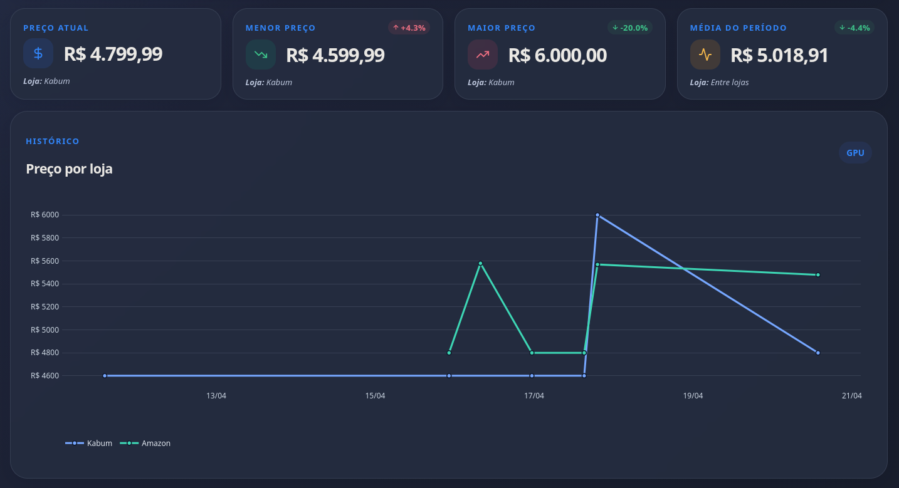
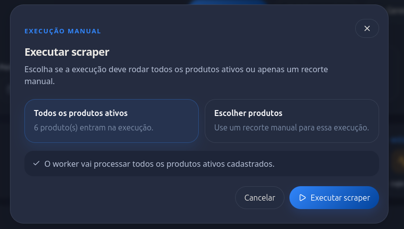
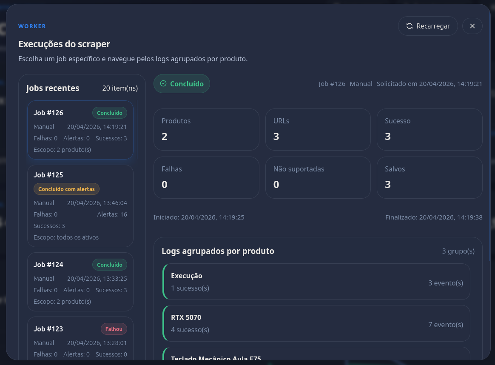

<h1 align="center">🛒 Collect Prices</h1>

<p align="center">
  <strong>Monitoramento automatizado de preços em e-commerces brasileiros.</strong>
</p>

<p align="center">
  Collect Prices é um sistema que automatiza a coleta de preços de produtos em e-commerces brasileiros, permitindo que você acompanhe o histórico de preços de qualquer produto cadastrado, compare valores entre lojas e identifique o melhor momento para comprar — tudo em um único painel.
</p>

<p align="center">
  <a href="https://github.com/joaoMatusalen">
    
  </a>
  <a href="https://www.linkedin.com/in/joaomatusalen/">
    
  </a>
</p>

---

## Porque Collect Prices?

O Collect Prices nasceu da necessidade de monitorar preços de produtos em diferentes e-commerces brasileiros. Queria uma solução que automatizasse meu processo de verificação de preços, enquanto trabalha e deixava meu computador ligado. Com o tempo, fui adicionando funcionalidades e melhorando a experiência do usuário. 

---

## Funcionalidades

<h4>Scraping automatizado</h4>
<ul>
  <li>Coleta de preços via Chrome headless com agendamento configurável via Ofelia (3× ao dia por padrão)</li>
  <li>Dispare o scraper pela interface ou deixe o agendador cuidar</li>
</ul>

<h4>14 lojas — Pré-configuradas e testadas</h4>
<ul>
  <li>Amazon, Kabum, Magazine Luiza, Mercado Livre, Americanas, Casas Bahia, Carrefour, Extra, Fast Shop, Netshoes, Ponto, Samsung, Casa das Cercas</li>
  <li>Padronização para maior facilidade em adicionar lojas</li>
</ul>

<h4>Dashboard interativo</h4>
<ul>
  <li>Gráficos de linha com histórico por loja, cards de métricas (atual, mínimo, máximo, média) e comparativo entre lojas</li>
  <li>Visualize dados dos últimos 7, 30, 60, 90 dias ou todo o histórico</li>
  <li>Isole métricas e gráficos de uma loja específica</li>
</ul>

<p align="center">
  
</p>

<h4>CRUD de produtos</h4>
<ul>
  <li>Cadastre produtos, gerencie múltiplas URLs por produto, ative/desative links individualmente</li>
</ul>

<p align="center">
  
</p>

<h4>Logs de execução</h4>
<ul>
  <li>Acompanhe cada job do scraper em tempo real com status, progresso e detalhes</li>
</ul>

<p align="center">
  
</p>

---

## Como usar?

### Pré-requisitos

<ul>
  <li><a href="https://docs.docker.com/get-docker/">Docker</a> e <a href="https://docs.docker.com/compose/">Docker Compose</a></li>
</ul>

### 1. Clone o repositório

```bash
git clone https://github.com/joaoMatusalen/collect-prices-in-web.git
cd collect-prices-in-web
```

### 2. Configure as variáveis de ambiente

```bash
cp .env.example .env
```

<p>Edite o <code>.env</code> com seus valores:</p>

```env
# Banco de dados
POSTGRES_DB=collect_prices
POSTGRES_USER=postgres
POSTGRES_PASSWORD=sua_senha_segura

# Conexão com frontend & api flask
DATABASE_URL=postgresql://postgres:sua_senha_segura@db:5432/collect_prices
VITE_API_URL=http://localhost:5000
CORS_ORIGIN=http://localhost:5173
```

### 3. Suba todos os serviços

```bash
docker compose up -d
```

<p>Isso inicializa o PostgreSQL, a API, o frontend, o worker do scraper e o agendador. As tabelas são criadas automaticamente na primeira execução.</p>

### 4. Acesse o dashboard

<p>Abra <a href="http://localhost:5173">http://localhost:5173</a> no navegador.</p>

---

## Configurações opcionais e uso

### Cadastrar um produto
<ol>
  <li>Clique em <strong>"Adicionar produto"</strong> na interface</li>
  <li>Informe o nome do produto e um grupo opcional</li>
  <li>Adicione URLs das lojas que deseja monitorar</li>
</ol>

### Cadastrar uma nova loja
<ol>
  <li>Vá até <code>scraper/app/scrapers/</code> e crie um novo arquivo <code>nome_da_loja.py</code></li>
  <li>Siga a formatação padrão dos outros arquivos</li>
  <li>Adicione o nome da loja no arquivo <code>scraper/app/runner.py</code></li>
</ol>

<p>Exemplo:</p>

```python
from selenium.webdriver.common.by import By
from .base import BaseScraper


class MinhaLojaScraper(BaseScraper):
    store_name = "Minha Loja"

    def extract(self, url):
        self.browser.get(url)
        self.wait_for_document_ready()
        price = self.wait_for_non_empty_text(By.CSS_SELECTOR, ".price-selector")
        return {"name": "", "price": price}
```

### Executar o scraper
<ol>
  <li>Clique em <strong>"Executar scraper"</strong> no header do dashboard</li>
  <li>Selecione os produtos que deseja raspar</li>
  <li>Clique em <strong>"Executar scraper"</strong></li>
</ol>

### Agendamento automático
<p>Por padrão, o Ofelia agenda a coleta para as <strong>12h, 15h e 20h</strong> (horário de Brasília). Edite <code>ofelia.ini</code> para alterar:</p>

<p>GitHub do agendador: <a href="https://github.com/mcuadros/ofelia">Ofelia</a></p>

```ini
[job-exec "scraper-enqueue"]
# segundo | minuto | hora | dia-do-mês | mês | dia-da-semana
# Exemplo: 0 0 12,15,20 * * * -> 12h, 15h e 20h
schedule = 0 0 12,15,20 * * *
container = scraper-worker
command = python enqueue_job.py --trigger scheduled
```

### Variáveis de ambiente opcionais

```env
# Frontend
CORS_ORIGIN=http://localhost:5173

# Zona de tempo para agrupamento diário
ANALYTICS_TIMEZONE=America/Sao_Paulo

# Controles do scraper
SCRAPER_PAGE_LOAD_STRATEGY=eager     # padrão: eager
SCRAPER_PAGE_LOAD_TIMEOUT_SECONDS=30 # padrão: 30
SCRAPER_IMPLICIT_WAIT_SECONDS=4      # padrão: 4
SCRAPER_WORKER_POLL_SECONDS=5        # padrão: 5
```

---

## Arquitetura

<p>O projeto segue uma arquitetura de microsserviços, orquestrada com Docker Compose:</p>

```
┌──────────────┐     ┌──────────────┐     ┌──────────────┐
│   Frontend   │────▶│   API Flask  │────▶│  PostgreSQL  │
│  React/Vite  │     │   :5000      │     │    :5432     │
│   :5173      │     └──────────────┘     └──────┬───────┘
└──────────────┘                                 │
                      ┌──────────────┐           │
                      │  Scheduler   │           │
                      │   (Ofelia)   │           │
                      └──────┬───────┘           │
                             │ enqueue           │
                      ┌──────▼───────┐           │
                      │   Scraper    │───────────┘
                      │   Worker     │
                      └──────────────┘
```

| Serviço | Stack | Porta | Descrição |
|---|---|---|---|
| **db** | PostgreSQL 16 Alpine | 5432 | Banco de dados com volume persistente |
| **api** | Python 3.11 / Flask | 5000 | API REST com CRUD de produtos, URLs, analytics e scraper jobs |
| **frontend** | React 19 / Vite 8 | 5173 | SPA com dashboard de preços, gráficos Plotly e tema dark/light |
| **scraper-worker** | Python 3.11 / Selenium / Chromium | — | Worker que processa jobs de scraping com Chrome headless |
| **scheduler** | Ofelia | — | Agendador cron que enfileira jobs automaticamente |

---

## Estrutura do Projeto

```
collect-prices-in-web/
├── backend/
│   └── api/
│       ├── app.py              # Factory da aplicação Flask
│       ├── db.py               # Pool de conexões e schema bootstrap
│       ├── routes/
│       │   ├── products.py     # CRUD de produtos
│       │   ├── urls.py         # CRUD de URLs por produto
│       │   ├── analytics.py    # Histórico de preços e estatísticas
│       │   ├── stores.py       # Lista de lojas
│       │   └── scraper.py      # Gerenciamento de jobs do scraper
│       └── Dockerfile
├── frontend/
│   ├── src/
│   │   ├── App.jsx             # Componente raiz
│   │   ├── components/         # MetricCard, ProductChart, StoreCard, modais...
│   │   ├── sections/           # HeroPanel, MetricsSection, StoreComparisonSection
│   │   ├── hooks/              # useProductList, useProductAnalytics, useTheme...
│   │   ├── styles/             # theme.css, layout.css, ui.css, modals.css
│   │   └── utils/              # Formatação de moeda e inferência de loja
│   └── Dockerfile
├── scraper/
│   ├── main.py                 # Entrypoint de execução direta
│   ├── worker.py               # Worker loop para processar jobs
│   ├── enqueue_job.py          # CLI para enfileirar jobs
│   ├── app/
│   │   ├── database.py         # Conexão PostgreSQL, queries do scraper
│   │   ├── runner.py           # Orquestrador de scraping
│   │   ├── jobs.py             # Gerenciamento de jobs (enqueue, claim, execute)
│   │   └── scrapers/           # Um módulo por loja (Amazon, Kabum, etc.)
│   └── Dockerfile
├── shared/
│   ├── schema.py               # DDL das tabelas (products, stores, price_history, jobs)
│   └── scraper_jobs.py         # CRUD de jobs compartilhado entre API e scraper
├── docker-compose.yml          # Orquestração dos 5 serviços
├── ofelia.ini                  # Agendamento cron do scraper
├── requirements.txt            # Dependências Python
└── .env.example                # Template de variáveis de ambiente
```

---

## API

<p>Base URL: <code>http://localhost:5000</code></p>

### Produtos

| Método | Rota | Descrição |
|---|---|---|
| `GET` | `/api/products` | Lista produtos (aceita `?active=true\|false`) |
| `POST` | `/api/products` | Cria produto com nome, grupo e URLs opcionais |
| `PUT` | `/api/products/:id` | Atualiza nome, grupo ou status ativo |
| `DELETE` | `/api/products/:id` | Exclusão lógica (desativa produto e URLs) |

### URLs

| Método | Rota | Descrição |
|---|---|---|
| `GET` | `/api/products/:id/urls` | Lista URLs do produto |
| `POST` | `/api/products/:id/urls` | Adiciona URL ao produto |
| `PUT` | `/api/urls/:id` | Atualiza URL ou status ativo |
| `DELETE` | `/api/urls/:id` | Remove URL permanentemente |

### Analytics

| Método | Rota | Descrição |
|---|---|---|
| `GET` | `/api/analytics/:product_id` | Histórico de preços + stats (`?days=30&store=all`) |

### Scraper

| Método | Rota | Descrição |
|---|---|---|
| `POST` | `/api/scraper/jobs` | Enfileira um novo job |
| `GET` | `/api/scraper/jobs` | Lista jobs recentes |
| `GET` | `/api/scraper/jobs/latest` | Retorna o job mais recente |
| `GET` | `/api/scraper/jobs/:id` | Detalhes e logs de um job |

### Lojas

| Método | Rota | Descrição |
|---|---|---|
| `GET` | `/api/stores` | Lista todas as lojas cadastradas |

---

## Banco de Dados

<p>PostgreSQL 16 com as seguintes tabelas:</p>

```
products          → id, name, group_name, active, created_at, updated_at
product_urls      → id, product_id (FK), url, active, created_at
stores            → id, name
price_history     → id, product_id (FK), store_id (FK), price, url, scraped_at
scraper_jobs      → id, status, trigger_type, requested_by, timestamps, counters
scraper_job_logs  → id, job_id (FK), level, event_type, message, details (JSONB)
```

<p>O schema é criado e migrado automaticamente na inicialização (idempotente).</p>

---

## Contribuições
<p>Contribuições são bem vindas, esse projeto tem como ação ajudar pessoas que possuem o mesmo problema em consultar preços de produtos em diferentes lojas. Sinta-se livre para contribuir com o projeto.</p>
